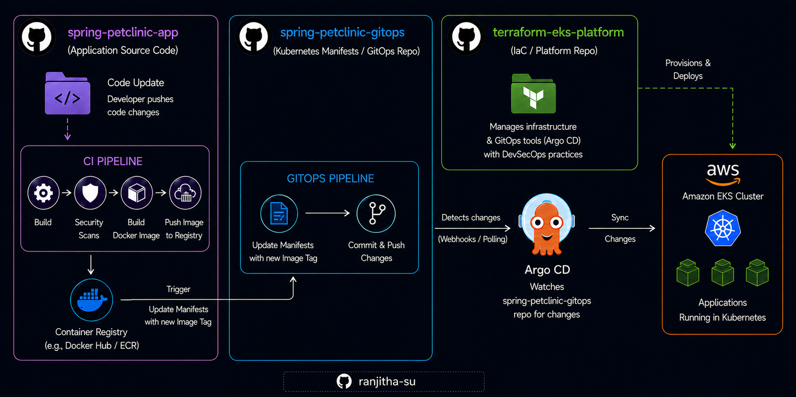

# 🔐 End-to-End DevSecOps Pipeline with GitLab CI/CD


---

## 📌 Overview

This project demonstrates a **production-grade DevSecOps CI/CD pipeline** built on **GitLab CI** for a Spring Boot application. It follows a **shift-left security** approach — embedding automated security controls at every stage of the pipeline, from the first commit all the way to the container registry.

Security is not an afterthought here. Every code push triggers secrets scanning, static analysis, dependency auditing, and container image scanning **before** anything reaches production.

---

## ✅ Security Scan in the Gitlab CI/CD

- **GitLeaks** – Catch leaked credentials before they travel downstream
- **SAST (Static Analysis)** – Detect code security vulnerabilities without running the app
- **SCA (Dependency Audit)** – Detect CVEs in third-party libraries via NVD
- **Container Image Scanning** – Block HIGH/CRITICAL vulnerabilities from reaching the registry
- **Keyless AWS Auth** – OIDC federation eliminates stored AWS credentials in GitLab
- **Centralised Reporting** – All scan artifacts aggregated and uploaded automatically using **Python script**
- **Docker BuildKit + ECR Caching** – Fast, reproducible container builds

📌 Read the full breakdown of each security tool in  

---

## 🚀 Getting Started

### Prerequisites

- GitLab account with CI/CD enabled
- AWS account with ECR repository - **spring-petclinic** created
- IAM Role configured for GitLab OIDC federation
- Docker installed locally (for local testing)

### 1️⃣ Clone the Repository

```bash
git clone git@gitlab.com:ranjitha-projects/security/spring-petclinic-secure-cicd-pipeline.git
cd spring-petclinic-secure-cicd-pipeline
```

### 2️⃣ Configure GitLab CI/CD Variables

⚠️ **Important:** Before running the pipeline, set these variables in **GitLab → Settings → CI/CD → Variables**:

| Variable | Description |
|----------|-------------|
| `AWS_ACCOUNT_ID` | Your AWS account ID |
| `AWS_DEFAULT_REGION` | AWS region (e.g. `us-east-1`) |
| `ROLE_ARN` | IAM Role ARN for OIDC federation |

### 3️⃣ Configure AWS OIDC Trust Policy

Add GitLab as a trusted OIDC provider in your AWS IAM Role trust policy so the pipeline can authenticate without static credentials.

### 4️⃣ Trigger the Pipeline

Push to any branch or manually trigger in GitLab CI/CD → Pipelines.

```bash
git add .
git commit -m "trigger pipeline"
git push origin main
```

---

## 🔧 Configuration Files

| File | Purpose |
|------|---------|
| `.gitlab-ci.yml` | Full pipeline definition — all stages and jobs |
| `Dockerfile` | Container image build instructions |
| `.gitleaks.toml` | Gitleaks suppression rules for false positives |
| `upload-reports.py` | Script to aggregate and upload scan reports |
| `k8s/` | Kubernetes deployment manifests |
| `docker-compose.yml` | Local development environment |

---

---

## 📌 Source Code Attribution

This project uses **[Spring PetClinic](https://github.com/spring-projects/spring-petclinic)** as its application base (maintained by the Spring team) It is used to demonstrate pipeline capabilities against real Java code.

| | Repository |
|---|---|
| Upstream | https://github.com/spring-projects/spring-petclinic |
| My Fork | https://github.com/ranjitha-su/spring-petclinic |

**The application code is unmodified.** My work is entirely in the platform layer — designing and implementing the end-to-end DevSecOps pipeline, integrating the security toolchain, containerising the app, and wiring up keyless AWS authentication via OIDC federation.

---

## 🔨 What I Built

This repository extends the original Spring PetClinic project with a **fully automated, security-hardened CI/CD pipeline** — to demonstrate real-world DevSecOps practices.

### CI/CD Pipeline with Integrated Security Scanning

The GitLab CI pipeline (`.gitlab-ci.yml`) was designed from the ground up with security at every stage:

- **Secrets Detection** — Gitleaks scans the full repository history for exposed credentials before any build begins
- **Static Application Security Testing (SAST)** — Semgrep analyses Java source code against the `p/java` ruleset to catch OWASP Top 10 vulnerabilities at commit time
- **Software Composition Analysis (SCA)** — OWASP Dependency Check audits all third-party dependencies against the NIST National Vulnerability Database
- **Container Image Scanning** — Trivy scans the built Docker image for HIGH and CRITICAL CVEs before it can be promoted downstream
- **Keyless AWS Authentication** — GitLab OIDC ID token federation replaces static AWS credentials with short-lived, role-scoped tokens
- **Centralised Reporting** — All scan artifacts are collected and uploaded automatically for audit and review
